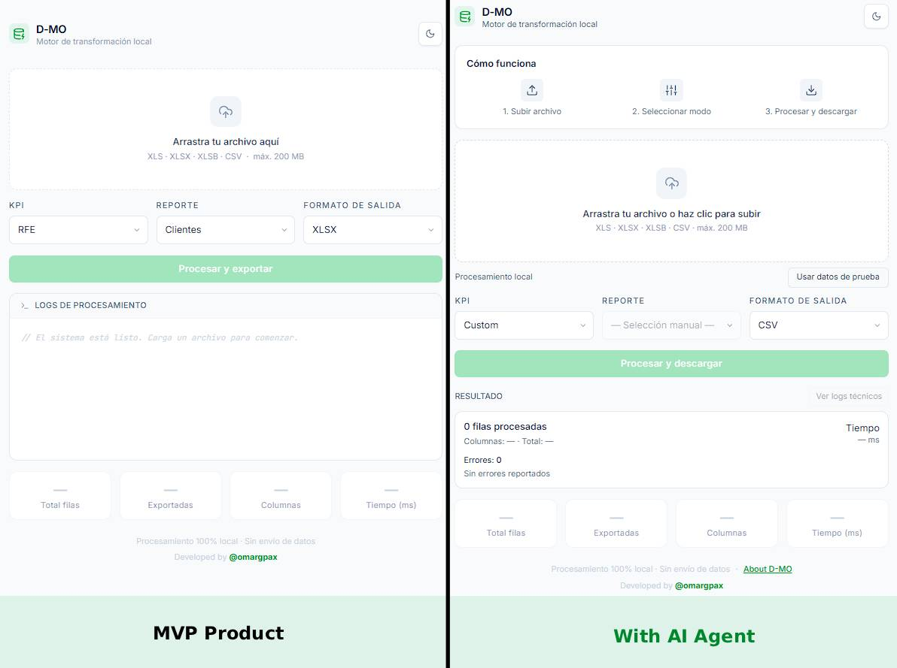

## [v1.2.0] — 2026-06-20

### 🚀 Features
- **Detección inteligente de reportes:** Implementación de algoritmos de correspondencia (`calculateCompatibility`, `detectBestMatch`) para identificar automáticamente el tipo de esquema RFE según las columnas del archivo cargado.
- **Capa de privacidad de metadatos:** Restricción de seguridad perimetral en la UI; las columnas autodetectadas y las advertencias de estructura solo se revelan si el archivo coincide en más del 50% con un esquema legítimo de la organización.
- **Nuevos componentes de interfaz:** - `src/components/Header.tsx`: Navbar global compartido y unificado.
  - `src/components/PreviewTable.tsx`: Previsualización ligera y eficiente de las primeras filas del archivo en caliente.
  - `src/components/HowItWorks.tsx`: Onboarding visual de 3 pasos integrado en el flujo principal.
- **Ruta `/about`:** Página dedicada `src/app/about/page.tsx` con la documentación del proyecto, guías de formato y especificaciones técnicas, aliviando la carga visual de la vista principal.

### 🔧 Changed
- **Refactor de `src/app/page.tsx`:** Reorganización completa del estado de la aplicación, consola de logs (separación de logs técnicos y resumen de negocio) y manejo de alertas contextuales.
- **Soporte nativo de Temas:** Integración de clases `dark:` en el Layout raíz y en el Header para garantizar una transición fluida y consistente en el modo oscuro (`bg-slate-50` / `bg-slate-950`).
- **Modularización:** Migración de la información estática de formatos de exportación desde paneles inline hacia la nueva interfaz de `/about`.
- **Selección de fila de encabezado (modo Custom):** Permite indicar qué fila del archivo contiene los nombres reales de las columnas; las filas previas se descartan automáticamente y el panel de selección de columnas se actualiza en tiempo real. El valor se confirma al salir del campo o al presionar Enter, evitando re-mapeos intermedios durante la edición.
- **Tipado robusto:** Incorporación de `src/styles.d.ts` para resolver side-effects de importación de CSS en el entorno de compilación de TypeScript.

### 🐛 Fixed
- **Falsos positivos en esquemas similares:** Corrección en el motor de compatibilidad mediante la creación de grupos equivalentes para evitar sugerencias cruzadas erróneas (ej. `cartera` ↔ `colocaciones`).
- **Fuga de estilos en Modo Oscuro:** Solucionado el problema de persistencia de fondos claros en el Header al alternar el tema global.
- **Persistencia de estado:** Corrección del ciclo de vida del estado de detección, asegurando un reset limpio de metadatos al remover el archivo actual.

---

### 📷 Antes / Después — Evolución de la Interfaz

* **Versión Anterior:** UI minimalista plana, navegación descentralizada, ausencia de feedback predictivo sobre el origen de los datos de entrada.
* **Versión Actual:** Arquitectura orientada a la experiencia de usuario (UX), detección asistida con control de errores dinámico, previsualización en cliente y documentación integrada.

